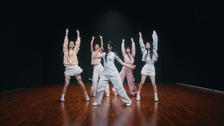
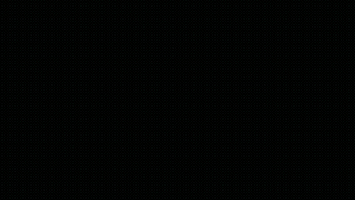

# Pose_visualization

映像から人間の骨格を取り出し、それを**作品として可視化**するリポジトリ。

単なる骨格描画ではなく、**残差を残す**（軌跡が一定時間で消える）ことと、**人物本体を薄く重ねる**
ことで、曲調や見た目からはわからない「激しさ」を別の側面として見せることを目的とする。

出力は**黒背景の中に骨格が最も強く表示され、その周りに本人が薄く映る**映像。

## デモ（推論前 / 推論後）

`data/input/Magnetic.mp4` の 8 秒区間（1:18〜1:26）を `extract` → `render` した比較。

| 推論前（元動画） | 推論後（骨格＋残差の可視化） |
|---|---|
|  |  |

## モデルの構成要素

| 要素 | 実体 | 役割 | 備考 |
|------|-----|-----|-----|
| 人物検出・セグメンテーション | **RF-DETR**（`rfdetr` の `RFDETRSegSmall`） | 人物 box + mask を1パスで取得 | box/mask を同時取得できるため追加のセグメンテーションモデルは使わない |
| トラッキング | 自前 IoU トラッカ（`tracking.py`） | フレーム間で人物 ID を維持 | 残差の連続性は ID の安定性に依存するため丁寧に実装 |
| 骨格推定 | **ViTPose**（`transformers.VitPoseForPoseEstimation` / `usyd-community/vitpose-base-simple`） | 人物 box ごとに17点キーポイント推定 | top-down モデルなので box が必須。box は **COCO 形式 `(x,y,w,h)`** で渡す（xyxy ではない） |
| 平滑化 | One-Euro フィルタ（`pose.py`） | 関節のジッタ除去 | トラック ID・関節ごとに独立して適用。**描画用**であり、平滑化前の生値も `keypoints_raw` として別途保存する |
| 残差抽出 | **AKAZE**（`akaze.py`） | 人物マスク内の特徴点をフレーム間対応付け | `estimateAffinePartial2D` で大域運動を推定し、そこからのズレ（＝残差）を「見た目からわからない激しさ」として使う |
| カメラ運動推定 | **AKAZE**（`akaze.py` の `CameraMotionEstimator`） | 人物を除いた背景からフレーム間の相似変換を推定 | 特徴量側でカメラのパン・ズームを差し引くための**計測専用**。描画には使わない |
| 音楽の拍推定 | **librosa**（`audio.py`） | 音声から拍時刻とテンポを推定 | 動きの位相を測る基準と、拍同期の演出に使う。任意ステージ |
| 単眼3D化 | **MotionBERT**（`lift3d.py`） | 2D キーポイント列を 3D に持ち上げる | **深層学習を「表現層」ではなく「計測改善層」として使う**。2D 関節角度が面外回転で歪む弱点を潰す目的で、出力は「関節角度」のまま説明可能。任意ステージ |
| 残差の寿命管理 | `residual.py` | 粒子・関節軌跡を一定時間でフェードアウト | 残差が大きいほど寿命を延ばす |
| 合成 | `render.py` | ゴースト層・残差層・骨格残像層・骨格層を加算合成 | 骨格層が必ず最高輝度になるよう最後に描く |

## 処理フロー

**extract（重い・1回だけ）→ render（軽い・何度も回す）の2ステージ**に分離する。

```
extract: 動画 → 検出/追跡/骨格/AKAZE軌跡 → data/cache/<name>.pkl.gz
render:  キャッシュ + 動画（薄い人物レイヤー用） + config → 出力mp4
```

アート作品として見た目の調整を何十回も繰り返す前提のため、**推論結果はキャッシュし、render は
モデル推論なしで完結させる**（`render.py` はキャッシュと生フレームだけを読む）。

## ディレクトリ構成

| パス | 役割 |
|------|-----|
| `src/pose_viz/cli.py` | サブコマンド（`extract`／`lift3d`／`beats`／`render`／`features`／`run`）のエントリポイント |
| `src/pose_viz/features/` | 解釈可能な動作特徴量（角度・速度・SPARC・負荷代理指標など）。**render からは import されない** |
| `src/pose_viz/lift3d.py` | MotionBERT による単眼 2D→3D リフティング。モデル推論を伴うので extract 側 |
| `src/pose_viz/audio.py` | librosa による音楽の拍・テンポ推定。音声デコードは既存の ffmpeg パイプを使う |
| `src/pose_viz/vendor/motionbert/` | MotionBERT のモデル定義（Apache-2.0）。取り込み理由と差分は同ディレクトリの README 参照 |
| `src/pose_viz/config.py` | dataclass 定義と YAML の読み込み・マージ |
| `src/pose_viz/video_io.py` | ffmpeg サブプロセスによる rawvideo パイプ I/O（`FrameReader`／`FrameWriter`／`mux_audio`） |
| `src/pose_viz/detect.py` | RF-DETR Seg Small ラッパ。person クラスでフィルタし box・score・mask を返す |
| `src/pose_viz/tracking.py` | IoU ベースの簡易トラッカ。ID の生成・維持・失効を管理 |
| `src/pose_viz/pose.py` | ViTPose ラッパ＋ One-Euro フィルタによる平滑化 |
| `src/pose_viz/akaze.py` | AKAZE 抽出・BFMatcher 対応付け・アフィン推定による残差ベクトル算出、および背景からのカメラ大域運動推定 |
| `src/pose_viz/cache.py` | extract 結果（pose／akaze／mask／カメラ運動）の pkl.gz 保存・復元・スキーマ版と設定ハッシュの検証 |
| `src/pose_viz/residual.py` | 粒子系・関節残像系の寿命とフェードカーブ |
| `src/pose_viz/render.py` | ゴースト層・残差層・骨格残像層・骨格層のレイヤ合成コンポジタ |
| `src/pose_viz/palette.py` | トラック ID ごとの配色・グロー・ブレンド関数 |
| `configs/default.yaml` | 全パラメータの既定値 |
| `configs/magnetic.yaml` | `data/input/Magnetic.mp4` 用の上書き設定 |

- `data/input/` … 入力動画（`Magnetic.mp4`：3840x2160・AV1・23.976fps・166秒・Opus音声）。**git 管理外**
- `data/cache/` … extract の出力（`.pkl.gz`）。**git 管理外**（重いので再生成する前提）
- `data/output/` … render の出力動画。**git 管理外**
- `data/features/` … features の出力（CSV・グラフ）。**git 管理外**

## セットアップ

Python 3.12（**uv** venv）。conda は使わない。

```bash
uv sync
uv run python -c "import torch, transformers, rfdetr, cv2; print(torch.backends.mps.is_available())"
```

上記が `True` になることを確認する（Apple Silicon の MPS が使える状態）。

## 使い方

### extract（検出・追跡・骨格・AKAZE残差の抽出、重い処理）

```bash
uv run pose-viz extract data/input/Magnetic.mp4 --start 30 --duration 15 --config configs/magnetic.yaml
```

| オプション | 内容 |
|---|---|
| `video` | 入力動画パス |
| `--out` | キャッシュの出力先（既定: `data/cache/<動画名>.pkl.gz`） |
| `--config` | 上書き設定 YAML |
| `--start` | 開始秒（試作用に一部だけ抽出する） |
| `--duration` | 抽出する長さ（秒） |

### render（キャッシュからの合成、モデル推論なし・軽い処理）

```bash
uv run pose-viz render --cache data/cache/Magnetic.pkl.gz --out data/output/magnetic_v1.mp4
```

| オプション | 内容 |
|---|---|
| `--cache` | extract で作成したキャッシュ（必須） |
| `--video` | 元動画パス（省略時はキャッシュ内のパスを使う） |
| `--out` | 出力動画パス（必須） |
| `--config` | 上書き設定 YAML |
| `--debug-overlay` | 黒背景ではなく元映像に検出結果を重ねて確認する |
| `--feature-modulation` | `off`（既定）／`load`（関節負荷の代理指標）／`speed`（関節速度）で骨格を変調する |
| `--audio` | 元動画の音声をミックスする |

`--feature-modulation load` を付けると、**負荷が高い関節ほど線が太く・芯が白熱する**。
色相は人物 ID を表す情報なので潰さず、白熱は彩度を抜く方向にだけ効かせているので、
「誰か」と「どこに負荷が出ているか」を同じ骨格の上で同時に読める。
`--debug-overlay` と併用すると各関節に数値が表示され、映像と数値を突き合わせられる。

```bash
uv run pose-viz render --cache data/cache/jellyous.pkl.gz --feature-modulation load --out data/output/load.mp4
```

**既定の `off` では特徴量を一切計算せず、従来と完全に同一の出力になる**（バイト単位で確認済み）。

**検証はまず `--debug-overlay` から**行い、box が人物に追従しているか・ID が入れ替わっていないか・
骨格が破綻していないか・AKAZE 点が人物の上にだけ乗っているかを目視確認する。

```bash
uv run pose-viz render --cache data/cache/Magnetic.pkl.gz --debug-overlay --out data/output/debug.mp4
```

### lift3d（単眼2D→3D化、任意）

**2D の関節角度は面外回転（カメラ面から外れた方向への屈曲）で系統的に歪む。**
その計測誤差を潰すためだけに MotionBERT で 3D に持ち上げる。得られるのは説明不能な埋め込みでは
なく、依然として「膝の屈曲角」という説明可能な量なので、**説明可能性を犠牲にせず精度だけが上がる**。

```bash
uv run pose-viz lift3d --cache data/cache/jellyous.pkl.gz
```

| オプション | 内容 |
|---|---|
| `--cache` | extract で作成したキャッシュ（必須） |
| `--out` | 書き出し先（既定: `--cache` と同じファイルを更新） |
| `--config` | 上書き設定 YAML |

キャッシュに `keypoints_3d` を足すだけで既存フィールドは触らない。以降 `features` は
自動的に 3D 由来の角度を使う（`feature.angle_source: auto`）。全尺 171 秒・19 トラックで約 90 秒。
モデル定義は [`src/pose_viz/vendor/motionbert/`](src/pose_viz/vendor/motionbert/) に固定してあり
（Apache-2.0）、重みは実行時に HuggingFace から取得する。

**実測での効果**（`jellyous.mp4` 全尺、10 トラック）:

| 指標 | 2D | 3D |
|---|---|---|
| 四肢長の変動係数（解剖学的には一定。低いほど良い） | 0.221 | **0.113**（−49%） |
| 肘の負荷を算出できたフレームの割合 | 65〜67% | **92〜93%** |
| 肩の負荷を算出できたフレームの割合 | 82% | **94〜95%** |

### beats（音楽の拍・テンポ推定、任意）

動画の音声から拍とテンポを推定してキャッシュに書き戻す。以降 `features` は
「動きが拍のどの位相に集まるか」を、`render` は拍に同期した演出を出せるようになる。

```bash
uv run pose-viz beats --cache data/cache/jellyous.pkl.gz
```

| オプション | 内容 |
|---|---|
| `--cache` | extract で作成したキャッシュ（必須） |
| `--video` | 元動画パス（省略時はキャッシュ内のパスを使う） |
| `--out` | 書き出し先（既定: `--cache` と同じファイルを更新） |

音声は既存の ffmpeg パイプでデコードし、librosa には波形だけを渡す。全尺 171 秒で 21 秒。

拍に同期した演出は `render.beat_bloom`（既定 0 = 無効）で有効にする。
**拍の瞬間にグローと粒子だけを増幅し、骨格の芯の明るさは変えない**（不変条件⑤を保つため）。

```bash
uv run pose-viz render --cache data/cache/jellyous.pkl.gz --config configs/beat.yaml --out data/output/beat.mp4
```

### features（動作特徴量の算出、モデル推論なし）

キャッシュから解釈可能な動作特徴量（関節角度・角速度・速度・SPARC・重心・収縮指数・QoM・
左右対称性・関節負荷の代理指標・動きの周期）を計算し、CSV とグラフに出力する。
全尺 171 秒・19 トラックでも 10 秒程度で終わる。

```bash
uv run pose-viz features --cache data/cache/jellyous.pkl.gz --plot
```

| オプション | 内容 |
|---|---|
| `--cache` | extract で作成したキャッシュ（必須） |
| `--out` | 時系列 CSV の出力先（既定: `data/features/<キャッシュ名>.csv`） |
| `--config` | 上書き設定 YAML |
| `--plot` | 検証用のグラフ（PNG）も出力する |
| `--plot-top` | グラフ化するトラック数（長い順、既定 3） |

出力は 3 つ。

- `<name>.csv` … 1 行 = 1 トラックの 1 フレーム（wide 形式）
- `<name>_summary.csv` … 1 行 = 1 トラック。**各指標に平均・中央値・p95 と「有効値の割合」を併記する**
- `<name>_plots/` … 検証用のグラフ

読むときの注意:

- **単位は body-length/秒**（体幹長で正規化した無次元長 ÷ 秒）。カメラ距離・体格差・fps に依存しない。
- **`load_*` は負荷の「代理指標」であり力学的な関節荷重ではない。** 同じ動画の中でのみ比較できる（§不変条件）。
- **平均と中央値の乖離は外れ値の目安。** 2D 姿勢推定は 0.1〜0.4% のフレームでキーポイントが飛び、
  そこだけ非現実的な速度が出る。頑健な統計量は中央値・p95 のほう。

### run（extract → render を通しで実行）

```bash
uv run pose-viz run data/input/Magnetic.mp4 --out data/output/magnetic_v1.mp4 --config configs/magnetic.yaml
```

## 厳守する不変条件（崩すと描画が壊れる／キャッシュが壊れる）

1. **ViTPose への box は COCO 形式 `(x, y, w, h)`**。xyxy のまま渡すと骨格がズレる。
2. **AKAZE は人物マスクでクロップした ROI にのみ適用する**。マスク無しで動画全体にかけると背景の
   特徴点まで残差として拾ってしまい、「その人の激しさ」という意味が失われる。
3. **extract と render は完全分離**。render 側でモデル推論を呼び出さない（重い処理を毎回の見た目調整で
   繰り返さないため）。
4. **キャッシュには設定ハッシュを埋め込む**。抽出時のパラメータ（検出閾値・トラッキング閾値等）が
   変わったら再抽出が必要になるため、`render` 側で不整合を検出して警告する。
5. **骨格レイヤーは必ず最後に最高輝度で描く**（`render.py` の合成順）。ゴースト層・残差層より後に、
   ブルームをかけた上で鋭い線を再度重ねる。特徴量による変調（`feature_modulation`）は
   **足すだけで引かない**。重みが低い関節を暗くするとこの不変条件が崩れるため、基準の線は常に
   元の明るさで描き、その上に太さと白熱コアを重ねる。
6. **One-Euro フィルタの状態はトラック ID・関節ごとに独立させる**。共有すると ID 交代時に前の人物の
   平滑化状態が新しい人物に漏れる。
7. **平滑化は「描画用」、計測は「生値」から行う**。One-Euro は低遅延・非対称なオンラインフィルタなので、
   その出力を微分すると速度・加速度が減衰する。`keypoints`（平滑化後）は描画に、`keypoints_raw`
   （平滑化前）は特徴量計算に使い、計測側では Savitzky-Golay のようなゼロ位相フィルタを別途かける。

## 実行環境

単一環境（Apple M5・32GB ユニファイドメモリ・macOS）を対象にする。学習は行わず、すべて推論のみ。

- **デバイス**: PyTorch は `mps` を優先し、未対応 op は `PYTORCH_ENABLE_MPS_FALLBACK=1` で CPU に
  フォールバックさせる。
- **rfdetr の MPS 対応は未確認**。動かない場合は検出フェーズのみ CPU 実行にする分岐を `detect.py` に
  持たせる。
- **AV1 デコードが重い場合**: `ffmpeg -i in.mp4 -vf scale=1920:-2 -c:v libx264 -crf 14 proxy.mp4` で
  H.264 プロキシを作り、以降はそちらを入力にする。

## 現状・未対応（今後）

**実装初期段階**。extract/render の基本的な配線はできている状態。

1. **軌跡の滑らかさの検証** — 純粋な AKAZE 記述子マッチングはフレーム毎に検出点が入れ替わりやすい。
   `config` の `akaze.trail_mode: akaze | akaze_lk`（LK 光学フローで伝播）を実映像で比較して既定を決める。
2. **マスク品質の検証** — `RFDETRSegSmall` のマスクは 512x512 ベースで輪郭がやや粗い。ゴースト層は
   ぼかして低 alpha で敷くだけなので実用上問題ない見込みだが、気になる場合は `PersonDetector`
   プロトコルの差し替え（SAM2 等）で対応できる形にしてある。
3. **rfdetr の MPS 対応** — 公式に MPS 対応の明記がないため、動かない場合は検出のみ CPU にフォールバックする。
4. **全尺（166秒）の処理時間・メモリ計測** — 現状は 10〜20秒の試作クリップで検証する段階。
5. **lint の自動化** — pytest は導入済み（`uv run pytest`、合成信号による解析解の検証）。ruff の設定はまだ無い。

## 今後の展望

現状は「見た目からわからない激しさ」を可視化するアート表現に留まっているが、将来的には以下の
方向へ発展させたい。

1. **アート表現としての作り込み** — 現在は骨格層・残差層・ゴースト層の加算合成のみ。配色のグラ
   デーション、楽曲のビートに同期したブルーム・パーティクル演出、カメラワークに応じた奥行き表現
   など、鑑賞に耐える映像作品としての作り込みを進めたい。
2. **関節負荷の可視化と怪我の早期発見支援** — 近年のダンスは振り付けの難易度・要求される可動域が
   年々上がっており、若いうちから膝・腰・股関節などを痛めるダンサーが増えている。ViTPose の関節
   角度・角速度や AKAZE 残差（フレーム間のズレ量）から特定の関節にかかる負荷を推定し、「見た目の
   激しさ」だけでなく「体への負荷が偏っている部位」を色や太さで強調表示できないか検討したい。
   本人・指導者が違和感に気づく前に負荷の偏りを可視化できれば、フォーム改善や怪我の早期発見に
   役立てられる可能性がある。医学的な閾値判定には専門知識が必要なため、まずは「同じ関節の負荷が
   動画内でどれだけ増減しているか」という相対比較から始める想定。

詳細な開発指針・不変条件・作業時のルールは [CLAUDE.md](CLAUDE.md) を参照。
